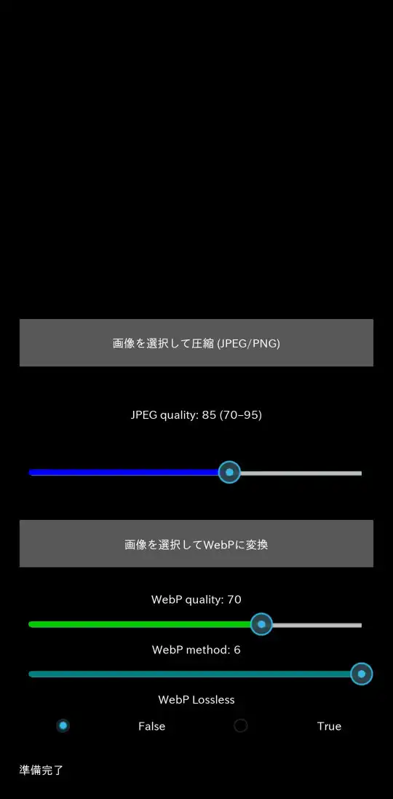
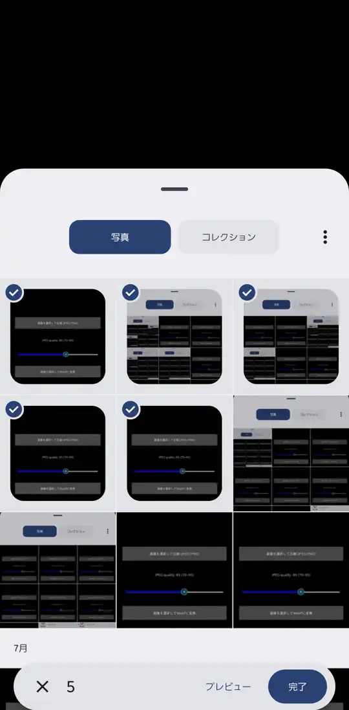
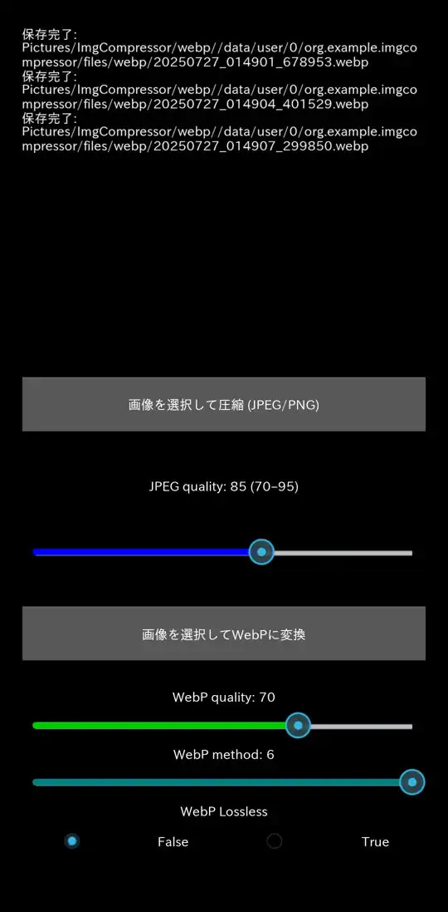

# ImgCompressor_kivy-android - Kivy製画像圧縮・変換アプリ

ImgCompressorは、Androidデバイス上で画像の圧縮やWebP形式への変換を行うKivy製のアプリケーションです

## 使用ライブラリ

本アプリでは以下のライブラリ／モジュールを使用しています：

- `Python 3.13`

- `Kivy`
UI フレームワーク。Android 表示・イベント処理に使用

- `androidstorage4kivy`
Android の共有ストレージとプライベート領域間のファイル入出力をサポート 

- `Pillow (PIL)`
画像の読み込み・リサイズ・JPEG／PNG／WebP 変換に使用

- `jnius`
Java クラス（Uri など）へのアクセスを可能にする Python-Java ブリッジ。

- `japanize_kivy`
Kivy アプリに日本語フォント表示を追加（日本語UI対応）

- 標準ライブラリ
`threading`, `os`, `sys`, `mainthread`

## 主な用途

- Android上で画像のリサイズ・圧縮およびWebP変換を行うアプリ
- ストレージ節約やSNS共有時のデータ軽減などに役立ちます

## 使い方
##### 1. アプリを起動
##### 2.「画像を選択して圧縮 (JPEG/PNG)」または「画像を選択してWebPに変換'」ボタンをタップ
##### 3. Androidのファイル選択ダイアログから変換したい画像 (.jpg/.jpeg/.png) を選ぶ
##### 4. 設定された品質／形式で変換・保存され、完了後にステータスメッセージが表示されます

#### ※品質設定（UIのスライダーなど）でJPEG圧縮率やWebPの品質・方式を調整できます。

保存場所は、`内部ストレージ/Pictures/ImgCompressor/`の、`resize`と`webp`というフォルダの中です

## ディレクトリ構成

```
ImgCompressor_kivy-android/
├── main.py                 # アプリ起動用エントリポイント
├── test.kv                 # メインレイアウトの kv ファイル
├── images/
├── LICENSE.txt
├── .gitignore
└── buildozer.spec
```

## ビルド手順

Ubuntu 22.04.5 LTS上にて、仮想環境から Buildozer を使って Android APK をビルドする流れをステップバイステップで示します\
※依存パッケージの具体的な一覧は省略し、環境構築の流れと注意ポイントにまとめています

#### 1. 仮想環境の準備

```
python3 -m venv buildozer-env
source buildozer-env/bin/activate
```

まず仮想環境を作成し、その仮想環境に入ります
`(buildozer-env)`とターミナルの先頭に表示されていれば、仮想環境に入れています

#### 2. Buildozer の初期化と設定

```
buildozer init
```

生成された `buildozer.spec`を編集\
アプリ名、パッケージ名、ライブラリ、パーミッションなどを設定します

`requirements = python3,kivy,pillow,androidstorage4kivy,japanize-kivy,libwebp`

#### 3. デバッグ用ビルドの実行

```
buildozer -v android debug
```

コマンドを実行し、成功するとapkが`bin/`に生成されます\
初回ビルドは時間がかかるため、気長に待ちましょう

## ビルド時に発生したエラーなど

ビルドを行う際に発生したエラーの原因と対処法を共有します

- `buildozer.spec`の記載漏れ
WebPの変換がAndroid上で行えていなかったのでコードを見直したが、合っていたので原因がすぐには分からなかった\
ChatGPTに質問をしたところ、Android上でWebPサポートを有効をするには、`Pillow`を`buildozer.spec`のrequirementsに記載するだけではなく、`libwebp`を追加する必要があると説明があった\
`main.py`に追記する必要はなく、`buildozer.spec`のrequirementsに追加するだけでよい

- `Cython`のエラー
```
jnius/jnius_utils.pxi:323:37: undeclared name not builtin: long
```

これは `Python 3` では long 型が廃止されたため、`Cython` が long を参照しようとするとエラーになる問題です\
とChatGPTが解説してくれた。また、`Cython` のバージョンを下げるとよいと回答があったため、`Cython 0.29`系を再インストールした

```bash
pip install "Cython<0.30"
```

- `main.py`を必ず含める
main.py が存在しない場合、下記のようなエラーでビルドが失敗します：

```
BUILD FAILURE: No main.py(c) found in your app directory. This file must exist to act as the entry point for your app.
```

## JPEG保存時の引数設定

- `quality`
画像の品質を70～95の範囲で変更できるようにします\
初期値の85はGoogleが薦めているらしいです

- `subsampling`
0に設定することで、色の情報を圧縮せず、より高品質な画像を得ることができます

- `optimize`
最適化を有効にすると、ファイルサイズを削減できます

## WebP保存時の引数設定

- `quality`
画像の品質を1～100の範囲で変更できるようにします\
初期値は70です

- `lossless`
Trueに設定すると、画質を維持しつつファイルサイズを削減できます

- `method`
圧縮方法を指定します\
0から6までの整数で、数値が大きいほど圧縮率が高くなりますが、処理時間も長くなります

- `optimize`
最適化を有効にすると、ファイルサイズを削減できます


## 出力ファイルの命名規則

すべての出力ファイルは、変換が実行された日時を元に一意に命名されます：

```
YYYYMMDD_HHMMSS[_fffffff].ext
```

例：`20250727_014312.jpg`、`20250727_023045_123456.webp`\
ミリ秒まで含めることで秒単位での連続処理による上書きを防止しています

#### 注意

元のファイル名（Screenshot_～など）は出力名には使われません \
ファイル名は自動生成され、変更される仕様です。元の名前の反映や保持はできません


## テスト環境

生成されたAPKファイルは以下の環境で動作確認済みです。

| 項目                | 内容                                       |
|---------------------|--------------------------------------------|
| デバイス             | Galaxy S21　　　　　　                      |
| Android バージョン   | Android 15（API 35）                       |


## スクリーンショット
トップ画面



画像選択画面
複数選択が可能



保存が完了すると、上部にメッセージが表示される




## ライセンス

本プロジェクトはMITライセンスの下で公開されています。詳細は`LICENSE.txt`をご覧ください。